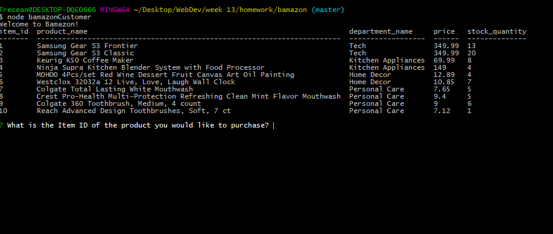
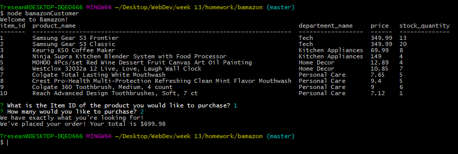

# bamazon

Bamazon is a CLI store using Node.js for server logic and MySQL for database interaction.

## Running Bamazon

When the program is run, the user is greeted and presented with a table of what is in "stock".

From here, the user is then able to complete the order by insterting the item Id of the item they would like to purchase as well as the quantity.

### Incorrect Order

If the item the user has selected is not in the store they will be displayed the table of available products again.

From there, the user can then run through process of making a correct purchase.